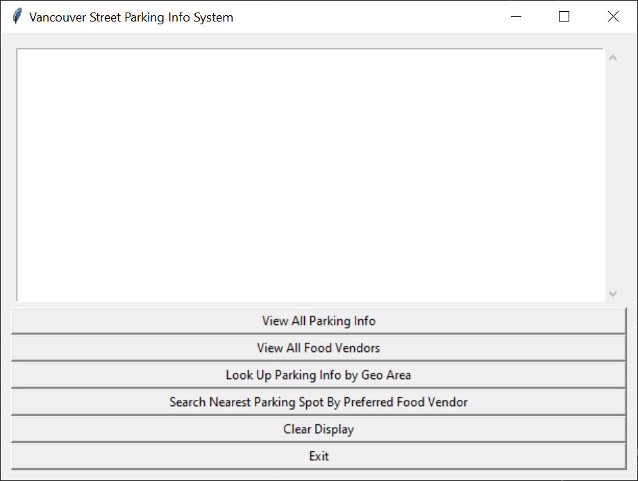
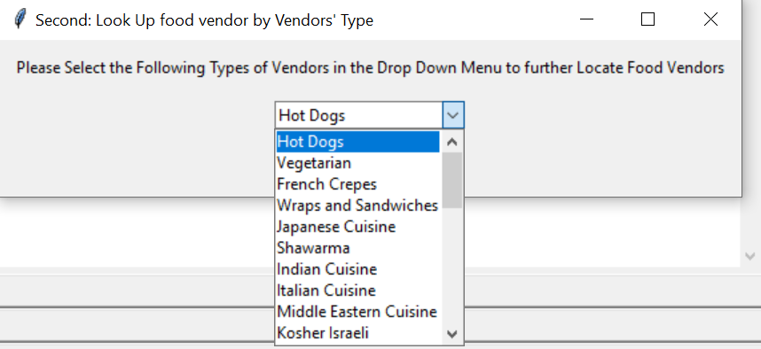
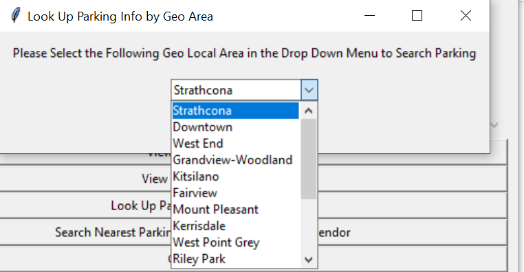
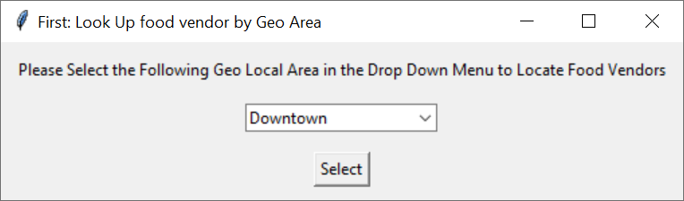
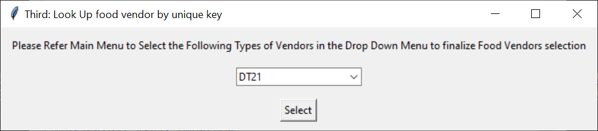
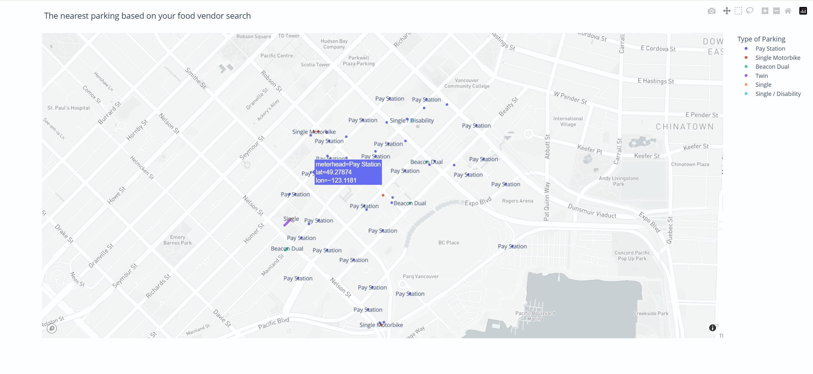
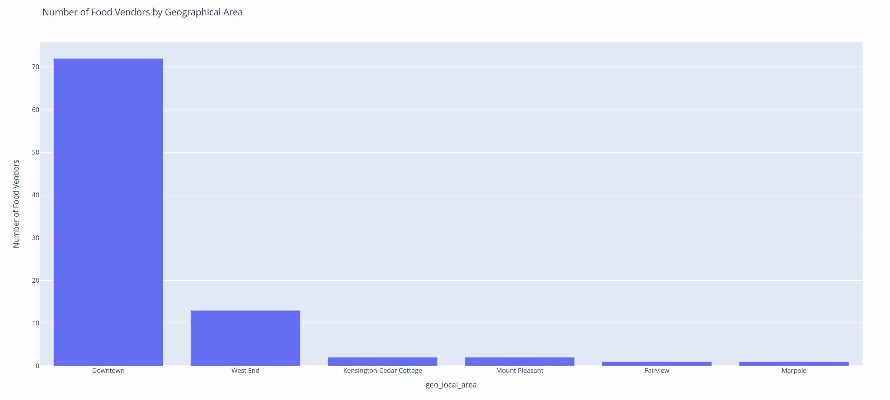
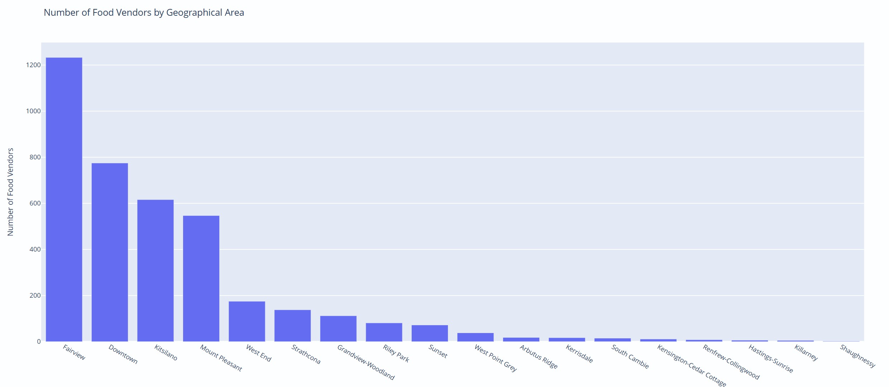

# 温哥华停车信息系统

本项目是一个基于图形界面的数据仪表板，用于浏览和分析温哥华停车位、餐车摊贩等相关信息，并通过图表和停车地图进行可视化展示。

## 运行环境

- 推荐 Python 版本：**3.12.3**（本项目在此版本下开发和测试）。

## 安装步骤

1. （可选但推荐）在项目根目录创建并启用虚拟环境：

   ```powershell
   python -m venv .venv
   .venv\\Scripts\\activate
   ```

2. 使用 `requirements.txt` 安装依赖：

   ```powershell
   pip install -r requirements.txt
   ```

   主要依赖库包括：

   - `plotly==5.20.0`
   - `pandas`
   - `requests`

## 运行方式

1. 确保当前终端所在目录为项目根目录 `Van_Parking_Info_System`。
2. 如果创建了虚拟环境，请先在终端中激活虚拟环境。
3. 运行主程序脚本：

   ```powershell
   python data_dashboard.py
   ```

4. 根据图形界面（GUI）中的提示进行操作：

   - 加载或刷新停车相关数据；
   - 查看柱状图等可视化结果；
   - 在停车地图中浏览各个停车点及其信息。

## 项目结构

- `data_dashboard.py`：程序入口文件，用于启动图形界面和数据仪表板。
- `models/`：数据模型目录，包含停车位、车辆、摊贩等相关类和结构。
- `utils/`：工具函数目录，用于数据获取与处理，例如从 API 或本地文件读取数据。
- `views/`：界面与可视化组件目录，包括 GUI、柱状图、停车地图等。
- `tests/`：单元测试目录，用于验证模型和工具函数的正确性。

## 使用提示

- 如果运行时报 “找不到模块（ModuleNotFoundError）” 等错误，请确认已在当前环境中执行过 `pip install -r requirements.txt`。
- 修改代码后，重新运行 `python data_dashboard.py` 以刷新界面和可视化结果。

## 界面示例

主界面：



按餐车类型查找摊贩：



按地理区域查询停车信息：



按地理区域与唯一编号查找餐车：




根据选择的餐车搜索最近停车位的地图展示：



各地理区域餐车数量示例柱状图：




## 作者

作者：**Weifan Li**。
